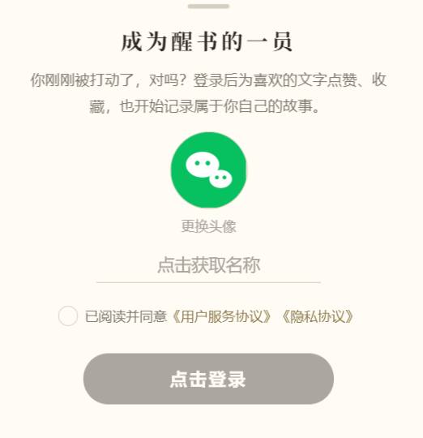

# 醒书日记小程序 · 用户操作指引

> 适用版本：v2.0（2026-07-22 大改版）——底部导航重构为固定四页签（醒书活动/醒书故事/醒书问答/醒书会员）；新增**醒书问答**模块；活动页改为首页并增加顶部 Banner；「善选」统一改称「**精选**」；评论收窄为会员专享、精选版本不设评论区；点赞数不再展示。
> 面向对象：新用户、运营人员（可直接作为对外使用说明的底稿）
> 配图说明：文中 `` 为截图占位，按文末「截图清单」拍摄后放入 `doc/images/guide/` 目录即可显示。

---

## 一、身份模型与功能速查

### 1.1 身份模型：两个维度、四种状态

醒书的权限由**两个相互独立的维度**决定，切勿混为一谈：

- **维度 A — 授权态**（是否已微信登录）：`未授权登录` / `已授权登录`
- **维度 B — 会员资格**（是否在有效期内）：`非会员` / `会员`（线下开通，¥365/年）

两维度交叉出**四种状态**。**关键规则：前端权限只认「当前授权态」，会员一旦退出登录即按游客处理（游客优先），重新登录才恢复会员权益。** 因此「会员·未授权登录」的**实时权限与纯游客完全相同**，差别仅在于重新登录后立即恢复。

| | **非会员** | **会员**（member_until 有效） |
|---|---|---|
| **未授权登录** | ①**访客·未授权**（纯游客）：可免登录读精选故事全文；互动/写作均需登录 | ③**会员·未授权**（退出登录的会员）：实时权限**等同纯游客**；重新登录即恢复全部会员权益 |
| **已授权登录** | ②**访客·已授权**（普通登录用户）：可互动/报名/分享海报；会员故事全库与写作仍需开通会员 | ④**会员·已授权**（完整会员）：全部功能——写故事 + 阅读全部已发布故事原文 |

**身份小知识**：
- 登录只获取微信身份标识（头像昵称自己填写），**不涉及手机号**。
- 会员到期当天仍算会员，过期后自动按普通用户处理。
- 会员资格的唯一凭据是**会员有效期**，与登录态无关——**退出登录不会丢失会员资格**，重新登录即刻恢复。

### 1.2 四大导航信息架构（深度拆分）

底部导航为**固定 4 个页签**（v2.0 起对所有身份一致，不再随身份增减）。各页签的信息层级如下：

**① 醒书活动**（**首页** · 所有身份可见）
- **顶部 Banner 轮播**：运营上传的线上/线下活动介绍图，可**手动左右拨动**；部分 Banner 可点进**图文详情页**（免登录可读），其余为纯展示
- **类型筛选横滑**：月度故事会 / 醒书咖啡 / 线下观影会 / 线下故事会 / 巧克力工坊 / 醒书厨房
- **活动列表**：按月份分组，含类型图标 · 时间地点 · 状态标签（报名中/已报名/进行中/已结束）
- **下钻 → 活动详情页**（非 tab）：时间（开始~结束自动算）· 地点（点击可导航）· 费用 · 报名进度 · 介绍（原文分段 + 图片）· 腾讯会议号（报名后可见）· 现场分享区 · 底部报名栏（**已结束/已过报名时间不显示报名按钮**）· 右上**收藏 + 邀请函**（六类主题 + 个人推荐码）
- **注**：原「活动分享」瀑布流子栏目 v2.0 暂时隐藏，现场分享内容仍在各活动详情页内展示

**② 醒书故事**（故事流，所有身份可见）
- **顶栏**：搜索框（按标题/内容/作者）· 筛选漏斗（标签 / 作者 / 时间三模式：快捷范围·起止日期·年月）· **星标精选筛选**（仅会员可见，点亮后只看精选故事）
- **故事卡片流**（内容按身份分流：会员见**全部已发布故事原文**，访客/普通登录见**精选副本**）
  - 卡片元素：作者头像昵称 · 发布时间 · 标题 · 正文 · 标签 · ♡ 已赞状态 · 🔖 已藏状态 · 💬 评论数（**点赞数与收藏数均不显示**）
  - 卡片标识：👁 已发布 · ☆ 金星 已入选精选 · 折角文档 暂存稿；**金色底卡**=非会员作者，「会」徽章=会员作者
- **悬浮**：右下「写故事」笔按钮（会员专享）
- **下钻 → 故事详情页**（非 tab 页）：标题 · 作者 · 标签 · 正文（**禁止框选复制**）· 配图 · 评论区（支持二级回复，**会员专享**）· 底部互动栏（赞/藏/分享）
  - 精选故事**免登录读全文**，但**精选版本不提供评论区**；打开未入选精选的会员故事 → 提示并转回故事列表

**③ 醒书问答**（v2.0 新增，所有身份可见）
- **顶栏**：搜索框（按问题内容）
- **问答卡片流**：提问者头像昵称（匿名提问显示为默认「醒」字头像 +「醒书同学」）· 提问时间 · 问题正文（最多 4 行）· ♡ 已赞状态 · 🔖 已藏状态 · **回答数**
  - 会员见**全部已发布问答原文**；访客/普通登录见**精选问答副本**
- **悬浮**：右下「提问」按钮（问答气泡图标，会员专享）
- **下钻 → 问答详情页**：问题正文 · 回答区（一层追评）· 底部「写回答」+ 赞/藏
  - 精选问答对公众开放，**可读全部回答但不能发**（回答本身就是答案，藏起来就没有阅读价值）
  - 提问与回答均可勾选**匿名**

**④ 醒书会员**（所有身份可见，按状态呈现）
- **未登录**：居中「微信登录」引导
- **已登录非会员**：身份卡 · 开通会员引导 · 个人资料编辑（头像/昵称/姓名/性别/手机号）· **我的收藏入口** · 互动统计
- **会员**：会员卡（有效期至）· 剩余天数与续费入口 · **我的故事 / 我的问答 / 我的收藏三个入口** · 互动统计 · 最近订单
- **设置弹层**（身份卡右上 ⚙）：协议入口 · **退出登录**
- **下钻（均为非 tab 页，左上返回回本页）**：
  - **我的故事**：自己的全部故事（含暂存稿）· 卡片为**作者数据视角**（👁 阅读 / ♡ 点赞 / 🔖 收藏 / 💬 评论，**点任一项弹出人员清单**）· 编辑 / 删除
  - **我的问答**：自己的全部问答（含暂存稿）· 编辑 / 删除
  - **我的收藏**：**故事 / 问答 / 活动三段切换**；故事与问答段带搜索（故事段另有筛选），点书签取消收藏、卡片即时移除

### 1.3 功能速查表（四身份权限）

> 列 ①②③④ 对应 1.1 的四种状态。**注意 ①（访客·未授权）与 ③（会员·未授权）两列完全相同**——因为退出登录的会员按游客处理；③ 列括号内标注的是**重新登录后**的恢复结果。

| 功能 | ① 访客·未授权 | ② 访客·已授权 | ③ 会员·未授权 | ④ 会员·已授权 |
|---|:---:|:---:|:---:|:---:|
| 底部导航页签 | **4**（活动/故事/问答/会员） | **4**（同左） | **4**（同左） | **4**（同左） |
| 浏览故事列表 | ✅ 精选故事 | ✅ 精选故事 | ✅ 精选故事 | ✅ 全部已发布故事 |
| 读精选故事全文 | ✅ **免登录** | ✅ | ✅ **免登录** | ✅ |
| 读非精选（会员）故事原文 | ❌ 引导开通 | ❌（仅精选） | ❌ 先弹登录（登录后→④✅） | ✅ 全部原文 |
| 星标精选筛选 | — | — | — | ✅ 会员专有开关 |
| 点赞 / 收藏（故事与问答） | ❌ 弹登录 | ✅ | ❌ 弹登录（登录后✅） | ✅ |
| **评论故事 / 回复**（v2.0 收窄） | ❌ | ❌ **需开通会员** | ❌ | ✅（精选版本无评论区） |
| 写故事 / 编辑（暂存/发布） | ❌ 引导开通会员 | ❌ 引导开通会员 | ❌ 弹登录（登录后✅） | ✅ |
| 浏览问答列表 / 读问答 | ✅ 精选问答 | ✅ 精选问答 | ✅ 精选问答 | ✅ 全部已发布问答 |
| 读精选问答的回答 | ✅ 只读 | ✅ 只读 | ✅ 只读 | ✅ 可回答 |
| **提问 / 回答**（可匿名） | ❌ 引导开通会员 | ❌ 引导开通会员 | ❌ 弹登录（登录后✅） | ✅ |
| 分享海报（仅精选故事） | ❌ 需登录 | ✅ 含推荐人归属 | ❌ 需登录（登录后✅ 含归属） | ✅ 含推荐人归属 |
| 右上角转发（所有故事） | ⚠️ 可转发但不计数 | ✅ 含推荐人归属 | ⚠️ 不计数（登录后含归属） | ✅ 含推荐人归属 |
| 浏览活动列表 / 顶部 Banner | ✅ | ✅ | ✅ | ✅ |
| 进入活动详情 / 报名 / 收藏活动 | ❌ 弹登录 | ✅ | ❌ 弹登录（登录后✅） | ✅ |
| **发布现场分享**（v2.0 收窄） | ❌ | ⚠️ 仅该活动**主理人/工作人员** | ❌ | ⚠️ 同左（与会员身份无关） |
| 生成活动邀请函 | ❌ 需登录 | ✅ 带个人推荐码 | ❌ 需登录（登录后✅） | ✅ 带个人推荐码 |
| 我的收藏（会员页入口） | ❌ | ✅ | ❌（登录后✅） | ✅ |
| 我的故事 / 我的问答（会员页入口） | ❌ | ❌ | ❌（登录后✅） | ✅ |
| 会员页状态 | 登录引导 | 开通会员引导 | 登录引导 | 有效期 + 续费 |

**一句话总结**：授权态决定「能不能点赞收藏」，会员资格决定「能不能写故事、提问回答、评论，以及读会员内容全库」；两者叠加，且**退出登录会临时把会员打回游客视角**。

### 1.4 打开小程序：品牌启动页

**每天第一次打开**小程序时，会先看到一屏「醒書知行社」品牌页——「修身為本」印章、社区简介和一个「**我要进入**」按钮。点一下即可进入，同一天内再次打开不会重复出现，次日恢复。

几点说明：
- 与身份无关，游客/会员都会看到。
- 从**扫码或好友转发**直接打开某篇故事、某场活动时同样会出现，且**盖在那篇故事/活动上**——点「我要进入」后直接看到对方分享给你的内容，不会跳走。
- 从后台切回小程序（热启动）不会再弹。

---

## 二、快速上手：登录

小程序**不强制登录**——游客可自由浏览，并可**完整阅读精选故事与精选问答**（含问答下的全部回答）。当你点击需要登录的操作（点赞、收藏、生成分享海报、进活动详情等）时，才会弹出登录半屏窗，登录成功后**自动继续你刚才的操作**（比如刚点的赞会直接生效）。

登录后可在「醒书会员」看到「我的收藏」入口；开通会员后再多出「我的故事」「我的问答」两个入口。

登录步骤：
1. 在弹出的「成为醒书的一员」窗口中，可选择更换头像（默认微信图标）
2. 点击"点击获取名称"填写昵称（可一键使用微信昵称）
3. 勾选同意《用户服务协议》《隐私协议》（可点击阅读）
4. 点「点击登录」完成

*图：任意页面触发的微信登录半屏窗*

也可以主动登录：底部导航「**醒书会员**」→ 点击红色「**微信登录**」按钮。

*图：未登录时的醒书会员——居中登录引导*

---

## 三、醒书活动（首页）

打开小程序看到的第一屏，**游客也可浏览**。

*图：活动首页——顶部 Banner 轮播、类型筛选、按月分组的活动列表*

### 3.1 顶部 Banner 轮播
运营上传的线上/线下活动介绍图，可**手动左右拨动**（不自动播放）。

- 部分 Banner 可**点进图文详情页**（免登录可读，介绍某类活动的完整内容）；其余为纯展示，点击无反应
- Banner 内容与顺序由运营在后台维护

### 3.2 活动列表
按开始时间倒序，带中文月份分隔。

- **类型筛选**：顶部横滑标签（月度故事会/醒书咖啡/线下观影会/线下故事会/巧克力工坊/醒书厨房）
- **类型图标**：咖啡杯、月牙、胶片、篝火、巧克力、锅具，一眼识别活动类型
- **状态**：报名中 / **已报名**（你报过的）/ 进行中 / 已结束
- 点任意行进详情（未登录先弹登录窗）

### 3.3 活动详情与报名（需登录）

*图：活动详情——时间地点、报名进度、介绍、现场分享区、底部报名栏*

- **报名**：底部「报名参加」，首次报名会引导完善姓名和手机号（同步到个人资料，之后一键确认）；可取消报名
- **收藏活动**：右上角书签图标，收藏的活动进入「我的收藏 → 活动」段
- **已报名可见**：
  - **报名名单**：点状态处查看已报名的伙伴（仅昵称头像）
  - **线上活动的腾讯会议号**（未报名显示"报名后可见"）
- **线下活动**：点地址可打开地图查看位置/导航
- **现场分享区**：所有登录用户都能浏览与点赞；**发布权限自 v2.0 起收窄——只有该活动的主理人与工作人员可发**（与是否会员无关）
- **邀请函**：点右上分享图标生成**主题邀请函**（六类活动各有专属设计），可保存相册或转发；邀请函带你的**专属小程序码**，新用户扫码登录后自动记你为推荐人

*图：活动邀请函——主题设计 + 个人推荐码*

> **关于「活动分享」瀑布流**：原来跨活动聚合现场分享的双列瀑布流页签，v2.0 起暂时隐藏。现场分享的内容仍完整保留在**各活动详情页内**。

---

## 四、醒书故事

故事流，按身份呈现不同内容：**会员**看到全部已发布故事；**游客与普通登录用户**看到的是运营精选出的「**精选故事**」（面向公众开放的优选内容）。

*图：故事页——搜索栏、精选筛选、故事卡片流、右下写故事按钮*

### 4.1 浏览与搜索
- **卡片信息**：作者头像昵称、发布时间、标题、正文（非会员见精选副本全文）、♡ 已赞状态、🔖 已藏状态、💬 评论数
  - **点赞数与收藏数均不显示**——只显示你自己有没有赞过、藏过
- **卡片标识**：右上角 👁 表示已发布的故事；👁 旁再带 ☆ 金星表示该故事**已入选精选**（公众可见）；折角文档图标为自己的暂存稿。**金色底卡片**表示作者是非会员，会员作者头像带「会」徽章
- **搜索**：顶部搜索框支持按标题、内容、作者搜索
- **筛选**：搜索框右侧漏斗按钮，可按标签、作者、时间（快捷范围/起止日期/年月）组合筛选
- **精选筛选（会员专有）**：漏斗右边的**星标按钮**，点亮后只显示精选故事，且切换到**公众看到的那个版本**（可能经运营修订、无评论区）；再点熄灭即回到全部故事
- **下拉刷新**：列表顶部下拉即可刷新

*图：筛选面板——标签、作者与三种时间模式*

### 4.2 阅读故事（精选故事免登录）
点任意卡片进入详情，**无需登录即可读完整的精选故事**（精选版本可能经运营修订）。通过好友转发链接打开**未入选精选**的会员故事时：未登录会先弹出登录窗（如果你本来就是会员，登录后即可阅读）；登录后若不是会员，会提示"会员专享"并自动回到醒书故事浏览精选故事。

*图：故事详情——正文、标签、点赞/收藏/分享底栏*

### 4.3 互动
- **点赞**（需登录）：卡片或详情页点 ♡，有 +1 浮动动画，再点取消
- **收藏**（需登录）：点书签图标，收藏的故事进入「我的收藏」
- **评论（会员专享）**：会员在故事详情页底部输入评论，支持对评论**二级回复**；自己的评论可删除
  - ⚠️ **精选版本不提供评论区**——非会员看到的、以及会员点亮星标筛选后看到的都是精选版本，这些页面不显示评论也不能评论。会员在普通视图（未点星标）下阅读即可评论
- **分享**：**仅精选故事**的卡片和详情页有分享按钮，生成**分享海报**——包含精选故事全文（不显示作者名），底部为醒书咨询品牌栏与带参小程序码，可保存到相册；扫码进来的新用户自动记你为推荐人。非精选故事只能通过小程序**右上角「…」菜单**转发给好友

*图：故事分享海报弹窗——全文 + 品牌栏 + 小程序码*

### 4.4 写故事（会员专享）
右下角圆形笔按钮进入写作页。非会员点击会弹窗引导开通会员。

- 正文支持**富文本**：五种颜色（黑/深红/黄/蓝/绿）、粗体、斜体、下划线、有序/无序列表、居中
- 编辑时右侧有**浮动格式工具条**（可拖动、自动贴键盘），点把手展开/收起
- 可添加图片、选择标签（可新建）
- 底部两个提交按钮：「**暂存**」仅自己可见（在「我的故事」里继续修改）；「**发布**」后面向全体会员开放。故事被运营纳入**精选**后才对公众可见（原文不受修订影响）

*图：写作页——富文本工具条、标签与暂存/发布双按钮*

---

## 五、醒书问答

v2.0 新增的模块：把读经典时的困惑提出来，让同路人一起回答。

*图：问答页——问题卡片流、右下提问按钮*

### 5.1 浏览问答
- **卡片信息**：提问者头像昵称、提问时间、问题正文（最多显示 4 行）、♡ 已赞状态、🔖 已藏状态、**回答数**
  - 与故事一致，**点赞数不显示**；但**回答数保留**——有几个人回答过是挑选阅读的重要信息
- **匿名提问**不显示头像与昵称，一律显示为默认「**醒**」字头像 + 署名「**醒书同学**」；**连提问者本人看到的也是这样**（匿名是彻底的）。自己的匿名提问仍能在「我的问答」里找到
- **头像底色区分不同匿名者**：同一串问答里，同一个人的提问与回答用同一种底色，不同人底色不同，便于分辨谁是谁；换到另一个问答则重新配色（避免凭颜色把同一个人跨帖认出来）
- **内容分流**：会员看到全部已发布问答；游客与普通登录用户看到运营精选的问答
- **搜索**：顶部搜索框按问题内容搜索

### 5.2 阅读与回答
点卡片进入详情，看到问题正文与全部回答。

- **精选问答对公众开放**：游客与普通登录用户**可以读到全部回答**，但**不提供发回答的入口**——回答本身就是答案，藏起来这个页面就没有阅读价值了
- **回答（会员专享）**：底部「写回答…」，可对某条回答再追评一层；自己的回答可删除
- **匿名回答**：发送前点输入框旁的「匿名」按钮点亮即可
- **点赞 / 收藏**（需登录）：底部 ♡ 与书签图标，收藏的问答进入「我的收藏 → 问答」段

### 5.3 提问（会员专享）
右下角问答气泡按钮进入提问页。非会员点击会弹窗引导开通会员。

- 只需填**问题正文**（无标题，最多 2000 字）
- 可打开「**匿名提问**」开关——开启后不显示你的头像和昵称，署名为「**醒书同学**」
- 底部两个按钮：「**暂存**」仅自己可见（在「我的问答」里继续修改）；「**发布**」后面向全体会员开放。被运营纳入**精选**后对公众可见

---

## 六、醒书会员

底部导航第四项，按身份显示不同内容。**「我的故事」「我的问答」「我的收藏」三个入口都收在这里**（v2.0 起不再占用底部页签）。

### 6.1 未登录
居中的登录引导：点红色「微信登录」按钮即可（见第二章配图）。

### 6.2 已登录（非会员）

*图：已登录非会员——身份卡、开通会员引导、个人资料、我的收藏入口、互动统计*

- **如何成为会员**：点「查看开通方式」→ 按步骤添加运营微信（可一键复制微信号）→ 线下转账 → 运营确认后**自动开通**，刷新页面即生效
- **个人资料**：点头像或「编辑」修改头像、昵称、真实姓名、性别、手机号
- **我的收藏入口**：个人资料下方（非会员没有故事和问答可写，故只有这一个入口）
- **互动统计**：已写故事 / 获赞 / 被收藏 / 评论与转发

### 6.3 会员

*图：会员——会员卡（有效期）、我的故事/问答/收藏三个入口、剩余天数与续费入口、最近订单*

- **会员卡**：昵称带「会员」徽章，显示**有效期至**；下方卡片显示**剩余天数**与「如何续费」
- **三个内容入口**（个人资料下方）：
  - 🖋 **我的故事** · ❓ **我的问答** · 🔖 **我的收藏**
- **续费**：与开通流程相同，续费后有效期在原到期日基础上顺延
- **最近订单**：显示最近一笔缴费记录

### 6.4 我的故事
展示你写的全部故事（含仅自己可见的暂存稿）。此处卡片是**作者数据视角**，与故事页/收藏页的浏览卡片不同：

- 卡片底部一排统计——👁 **阅读数** / ♡ **点赞数** / 🔖 **收藏数** / 💬 **评论数**；**点任一项弹出人员清单**（头像 + 昵称 + 时间，评论另带评论内容），可查看到底是谁读过/赞过/藏过/评过你的故事（此处点击**不是**做互动，而是看数据）
- 每张卡片带「**编辑**」「**删除**」按钮（删除需二次确认，删除后不可恢复）
- 暂存稿卡片带折角文档图标，不会出现在故事列表；已入选精选的故事卡片带 ☆ 金星徽章
- 右下笔按钮写新故事；左上返回箭头回醒书会员

> 说明：阅读数只统计**他人**的阅读——作者反复打开自己的故事**不计入**阅读数。

*图：我的故事——数据统计一排 + 人员清单弹窗 + 编辑/删除按钮*

### 6.5 我的问答
展示你提的全部问题（含暂存稿）。

- 卡片显示问题正文与**回答数**
- 每张卡片带「**编辑**」「**删除**」按钮（删除后该问题的回答一并不可见，且若已入选精选会同步下架）
- 右下问答气泡按钮提新问题；左上返回箭头回醒书会员

### 6.6 我的收藏
分**故事 / 问答 / 活动**三段切换。

- **故事段**：支持搜索与筛选（同故事页）；非会员只显示其中已精选的部分
- **问答段**：支持搜索
- **活动段**：按收藏时间倒序，已结束的活动置灰显示
- 三段都是点书签取消收藏，卡片即时移除（误点可再点恢复）
- 左上角返回箭头回醒书会员

*图：我的收藏——故事/问答/活动三段*

### 6.7 设置与退出登录
身份卡右上角 ⚙ 齿轮 → 设置弹层：
- 查看《用户服务协议》《隐私协议》
- **退出登录**：退出后回到游客身份；**会员资格保留**，重新登录即恢复

*图：设置弹层——协议入口与退出登录*

---

## 七、常见问题

**Q：登录会获取我的手机号吗？**
不会。登录仅获取微信身份标识，头像昵称由你自己填写；手机号仅在报名活动/编辑资料时**选填**，用于活动通知，不会公开。

**Q：什么是"精选故事"？我不是会员能看什么？**
会员发布的故事默认面向会员开放；运营会不定期从中精选出「精选故事」对所有人开放。**精选故事无需登录就能读全文**（分享给朋友也能直接看）；打开未入选的会员故事会提示开通会员。点赞、收藏、评论则需要先登录。

**Q：底部导航怎么变了？「我的故事」「我的收藏」去哪了？**
v2.0 起底部导航固定为 **4 个页签**（醒书活动/醒书故事/醒书问答/醒书会员），对所有身份一致，不再随身份增减。「**我的故事**」「**我的问答**」「**我的收藏**」三个入口都收进了**醒书会员**页——登录后进醒书会员，在「个人资料」下方即可看到。功能本身没有变化。

另外原来的首页「醒书广场」改名为「**醒书故事**」并移到第二个位置，第一个位置换成了「醒书活动」。

**Q：我发布的故事别人什么时候能看到？**
「发布」后全体会员立即可见；被运营纳入精选后公众也可见（精选展示的是运营整理的副本，你的原文不会被改动）。「暂存」的故事只有自己可见。

**Q：我是会员，为什么写故事按钮提示开通会员？**
请检查是否处于退出登录状态（醒书会员显示"微信登录"按钮即未登录）——重新登录即恢复；若已登录仍提示，可能是会员已到期，可在醒书会员查看有效期。

**Q：怎么开通/续费会员？**
醒书会员 → 查看开通方式 → 添加运营微信线下转账，运营确认后自动生效，无需其他操作。

**Q：报名后在哪里看会议号？**
线上活动的腾讯会议号在**报名后**的活动详情页显示；未报名时显示"报名后可见"。

**Q：现场分享为什么发不了？**
v2.0 起现场分享的**发布权限收窄为该活动的主理人与工作人员**（与是否会员无关），普通参与者不再有发布入口。所有登录用户仍可以浏览和点赞现场分享。

**Q：为什么我不能评论故事了？**
v2.0 起**评论为会员专享**。另外**精选版本的故事不提供评论区**——游客与普通登录用户看到的都是精选版本，会员点亮星标筛选时看到的也是精选版本；会员在普通视图（未点星标）下阅读即可评论。

**Q：什么是匿名提问/匿名回答？**
在醒书问答里发问或回答时可以勾选匿名。匿名后**不显示你的头像和昵称**，统一显示为默认「**醒**」字头像 + 署名「**醒书同学**」——**你自己看到的也是这样**，匿名是彻底的。自己发过的匿名内容仍能在「我的问答」里找到，匿名回答旁也仍有「删除」按钮。

---

## 附：截图清单（维护用）

以下截图请在**体验版/开发者工具**中按场景截取（iPhone 机型模拟即可），保存为 PNG 放入 `doc/images/guide/`：

| 文件名 | 拍摄内容 | 所需账号状态 |
|---|---|---|
| `splash-cover.png` | 每日首次冷启动的品牌启动页（清缓存后重新编译可复现） | 任意 |
| `activities.png` | 活动首页（顶部 Banner 轮播 + 类型筛选 + 活动列表） | 任意 |
| `banner-detail.png` | Banner 图文详情页 | 任意 |
| `login-sheet.png` | 故事页点赞时弹出的登录半屏窗 | 游客 |
| `member-guest.png` | 醒书会员未登录态（居中登录引导） | 游客 |
| `square.png` | 醒书故事页（含星标精选筛选按钮） | 会员 |
| `filter-sheet.png` | 故事筛选面板展开 | 任意 |
| `diary-detail.png` | 一篇故事详情（会员视角，有评论区） | 会员 |
| `poster-sheet.png` | 精选故事分享海报弹窗（全文+品牌栏） | 已登录 |
| `compose.png` | 写故事页（工具条展开、含暂存/发布双按钮） | 会员 |
| `qa.png` | 醒书问答页（含匿名问题卡片与右下提问按钮） | 任意 |
| `qa-detail.png` | 问答详情（问题 + 若干回答，含匿名回答） | 会员 |
| `qa-compose.png` | 提问页（含匿名开关与暂存/发布双按钮） | 会员 |
| `activity-list.png` | 活动列表（含类型筛选与状态） | 已登录（有已报名场次更佳） |
| `activity-detail.png` | 活动详情（报名栏 + 右上收藏/邀请函可见） | 已登录 |
| `invite-card.png` | 生成的活动邀请函 | 已登录 |
| `collections.png` | 我的收藏（三段切换，各段有内容） | 已登录 |
| `mine.png` | 我的故事（含一篇暂存稿 + 人员清单弹窗） | 会员 |
| `my-qa.png` | 我的问答（含一条暂存稿） | 会员 |
| `member-authed.png` | 醒书会员已登录非会员态（含我的收藏入口） | 已登录非会员 |
| `member-member.png` | 醒书会员会员态（有效期 + 三个内容入口） | 会员 |
| `settings-sheet.png` | 设置弹层（退出登录） | 已登录 |
